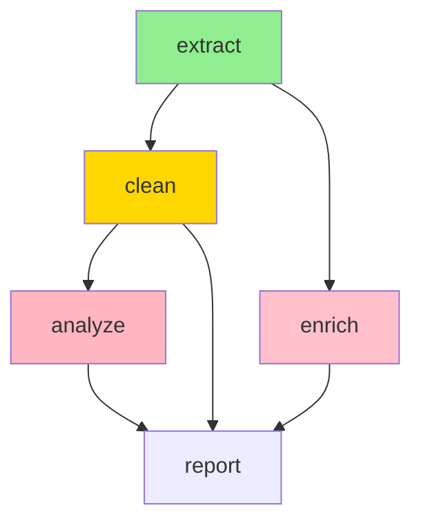

# Dependency Management for Multi-Agent Systems

**Date:** 2026-02-21 08:20 PM  
**Topic:** Handling dependencies between agents and tasks

---

## Dependency Types

| Type | Description | Example |
|------|-------------|---------|
| **Hard** | Must complete before dependent starts | `load_db` needs `transform_data` |
| **Soft** | Preferred but has fallback | `enrich_data` can use cached if live fails |
| **Resource** | Competes for shared resource | Two agents need write lock on same file |
| **Temporal** | Must happen in sequence | `cleanup` only after `process` |
| **Data** | Output of A is input of B | `chunk_1.json` → `aggregate.json` |

---

## The DAG Principle

**All dependencies must form a Directed Acyclic Graph (DAG).**

```
✓ Valid DAG:
     [A]
    /   \
   [B]  [C]
    \   /
     [D]

✗ Invalid (cycle):
     [A] → [B]
      ↑     ↓
      └────[C]
```

**Cycle Detection:** Check before execution.

```javascript
function detectCycle(graph) {
  const visited = new Set();
  const recursionStack = new Set();
  
  function dfs(node) {
    visited.add(node);
    recursionStack.add(node);
    
    for (const neighbor of graph[node] || []) {
      if (!visited.has(neighbor)) {
        if (dfs(neighbor)) return true;
      } else if (recursionStack.has(neighbor)) {
        return true; // Cycle found
      }
    }
    
    recursionStack.delete(node);
    return false;
  }
  
  for (const node in graph) {
    if (!visited.has(node)) {
      if (dfs(node)) return true;
    }
  }
  return false;
}
```

---

## Declaring Dependencies

### YAML Manifest

```yaml
# workflow.yaml
tasks:
  - id: "extract"
    agent: "extractor"
    input: "data/raw.csv"
    output: "data/extracted.json"
    deps: []
    
  - id: "clean"
    agent: "cleaner"
    input: "data/extracted.json"
    output: "data/clean.json"
    deps: ["extract"]
    
  - id: "analyze"
    agent: "analyzer"
    input: "data/clean.json"
    output: "data/analysis.json"
    deps: ["clean"]
    
  - id: "report"
    agent: "reporter"
    inputs:
      - "data/clean.json"
      - "data/analysis.json"
    output: "output/report.pdf"
    deps: ["clean", "analyze"]  # Fan-in dependency
```

### Code API

```javascript
// Declare dependencies explicitly
const taskA = await orchestrator.createTask({
  id: "extract",
  agent: "extractor",
  run: () => extractData()
});

const taskB = await orchestrator.createTask({
  id: "transform",
  agent: "transformer",
  deps: [taskA],  // Hard dependency
  run: () => transformData()
});

const taskC = await orchestrator.createTask({
  id: "enrich",
  agent: "enricher",
  deps: [
    { task: taskA, type: "required" },
    { task: taskB, type: "optional", fallback: "cached" }
  ],
  run: (inputs) => enrichData(inputs)
});
```

---

## Execution Strategies

### Strategy 1: Level-Order (BFS)

Execute all tasks at each depth before proceeding.

```
Level 0: [extract]
Level 1: [clean]
Level 2: [analyze]
Level 3: [report]

Max parallelism: 1 (sequential in this case)
```

**Best for:** Simple pipelines, predictable resource usage.

### Strategy 2: Greedy (As-Ready)

Spawn any task whose dependencies are satisfied.

```
Time 0: [extract] starts
Time 5: [clean] starts (extract done)
Time 8: [analyze] starts (clean done)
Time 10: [report] starts (clean done at 8, analyze done at 10)

Max parallelism: Depends on graph structure.
```

**Best for:** Most cases, maximum parallelism.

### Strategy 3: Critical Path Priority

Prioritize tasks on the longest path.

```
Graph:
  [A: 5s] → [C: 10s] → [E: 2s]  # Path: 17s (critical)
  [B: 3s] → [D: 4s] → [E: 2s]   # Path: 9s
  
  Schedule: A first (critical), then B, C, D, E
```

**Best for:** Optimizing total completion time.

---

## Dependency Resolution

### Basic Resolver

```javascript
class DependencyResolver {
  constructor(tasks) {
    this.tasks = new Map(tasks.map(t => [t.id, t]));
    this.completed = new Set();
    this.failed = new Set();
    this.running = new Set();
  }
  
  getReadyTasks() {
    const ready = [];
    for (const [id, task] of this.tasks) {
      if (this.completed.has(id) || this.failed.has(id) || this.running.has(id)) {
        continue;
      }
      
      const depsSatisfied = task.deps.every(dep => {
        if (dep.type === "optional") {
          return this.completed.has(dep.task) || dep.fallback;
        }
        return this.completed.has(dep.task);
      });
      
      if (depsSatisfied) ready.push(task);
    }
    return ready;
  }
  
  markComplete(taskId) {
    this.completed.add(taskId);
    this.running.delete(taskId);
  }
  
  markFailed(taskId) {
    this.failed.add(taskId);
    this.running.delete(taskId);
    
    // Check downstream impact
    for (const [id, task] of this.tasks) {
      const hasHardDep = task.deps.some(d => 
        d.task === taskId && d.type !== "optional"
      );
      if (hasHardDep) {
        console.log(`Task ${id} blocked due to ${taskId} failure`);
      }
    }
  }
  
  isComplete() {
    return this.completed.size + this.failed.size >= this.tasks.size;
  }
}
```

---

## Handling Failures

### Propagation Rules

| Task Status | Hard Dep | Soft Dep | Resource | Action |
|-------------|----------|----------|----------|--------|
| Failed | Block | Use fallback | Release lock | Skip or alternate |
| Timeout | Retry 2x | Use cached | Reacquire | Alert + retry |
| Partial | Continue with warning | Continue | Continue | Log + proceed |

### Recovery Strategies

```javascript
async function handleFailure(task, error) {
  switch (error.type) {
    case "TRANSIENT":
      // Retry with exponential backoff
      await retryWithBackoff(task, { maxRetries: 3 });
      break;
      
    case "PERMANENT":
      // Look for alternate path
      const alternate = findAlternatePath(task);
      if (alternate) {
        await executeAlternate(alternate);
      } else {
        // Cascade: fail downstream
        markBlocked(task.dependents);
      }
      break;
      
    case "TIMEOUT":
      // Check if partial results available
      if (await hasPartialResults(task)) {
        await continueFromPartial(task);
      } else {
        await restartFromCheckpoint(task);
      }
      break;
  }
}
```

---

## Resource Dependencies

### Token-Based Locking

```javascript
class ResourceManager {
  constructor() {
    this.locks = new Map();
    this.queue = new Map();
  }
  
  async acquire(resourceId, taskId, timeout = 30000) {
    if (!this.locks.has(resourceId)) {
      this.locks.set(resourceId, taskId);
      return true;
    }
    
    // Queue for later
    if (!this.queue.has(resourceId)) {
      this.queue.set(resourceId, []);
    }
    this.queue.get(resourceId).push(taskId);
    
    // Wait with timeout
    return new Promise((resolve, reject) => {
      const timer = setTimeout(() => {
        reject(new Error(`Timeout waiting for ${resourceId}`));
      }, timeout);
      
      const checkInterval = setInterval(() => {
        if (this.locks.get(resourceId) === taskId) {
          clearTimeout(timer);
          clearInterval(checkInterval);
          resolve(true);
        }
      }, 100);
    });
  }
  
  release(resourceId, taskId) {
    if (this.locks.get(resourceId) !== taskId) {
      throw new Error(`Task ${taskId} does not hold lock for ${resourceId}`);
    }
    
    this.locks.delete(resourceId);
    
    // Grant to next in queue
    const queue = this.queue.get(resourceId) || [];
    if (queue.length > 0) {
      const next = queue.shift();
      this.locks.set(resourceId, next);
    }
  }
}
```

### Conflict Detection

```javascript
function detectResourceConflict(tasks) {
  const resourceTasks = new Map();
  
  for (const task of tasks) {
    for (const resource of task.resources || []) {
      if (!resourceTasks.has(resource)) {
        resourceTasks.set(resource, []);
      }
      resourceTasks.get(resource).push(task.id);
    }
  }
  
  // Find resources used by parallel tasks
  const conflicts = [];
  for (const [resource, taskIds] of resourceTasks) {
    if (taskIds.length > 1) {
      // Check if any pair runs in parallel
      for (let i = 0; i < taskIds.length; i++) {
        for (let j = i + 1; j < taskIds.length; j++) {
          if (mayRunInParallel(taskIds[i], taskIds[j])) {
            conflicts.push({ resource, tasks: [taskIds[i], taskIds[j]] });
          }
        }
      }
    }
  }
  
  return conflicts;
}

function mayRunInParallel(taskA, taskB, graph) {
  // Two tasks can run in parallel if neither depends on the other
  const depsA = getAllDeps(taskA, graph);
  const depsB = getAllDeps(taskB, graph);
  
  return !depsA.has(taskB) && !depsB.has(taskA);
}
```

---

## Dependency Visualization

```
CLI Output:

Workflow: data-pipeline

[extract]      ═══╗
(5s) done         ║
                  ╠═→ [report] (waiting)
[clean]      ═══╗ ║    (needs: clean, analyze)
(3s) running    ║ ║
                ╠═→ [analyze]
[enrich]     ═══╝    (queued)
(2s) queued

Legend: ═══╗  = dependency flow
         ═══╝  = fan-in
```

### Mermaid Diagram



---

## Best Practices

**DO:**
- ✅ Explicitly declare all dependencies
- ✅ Use semantic versioning for task contracts
- ✅ Handle optional dependencies with fallbacks
- ✅ Release resources in `finally` blocks
- ✅ Add timeout to all dependency waits

**DON'T:**
- ❌ Implicit dependencies ("it just knows")
- ❌ Long chains (>5 sequential deps) — add checkpoints
- ❌ Circular dependencies — detect and break
- ❌ Hold locks while waiting for other resources (deadlock risk)

---

## Quick Reference: Dependency Declaration

| Dependency | Declaration | Handling |
|------------|-------------|----------|
| Hard | `deps: ["task-a"]` | Wait & fail if blocked |
| Soft | `deps: [{id:"task-b", optional:true, fallback:"cache"}]` | Proceed with fallback |
| Resource | `resources: ["db-write"]` | Acquire lock, release in finally |
| Anti | `conflicts: ["task-c"]` | Don't run simultaneously |

---

**Related:** See `task-decomposition.md` for splitting work; `multi-agent-coordination.md` for executing with dependencies.
